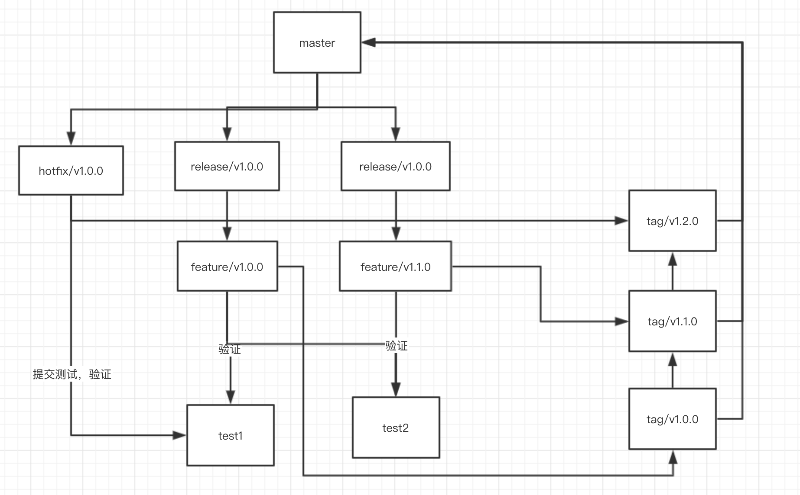

# git 规范

1. 全局安装commitizen & cz-conventional-changelog

```sh
npm install -g commitizen cz-conventional-changelog
echo '{ "path": "cz-conventional-changelog" }' > ~/.czrc
```

安装完毕后，可直接使用git cz来取代git commit。


- master 分支: 线上稳定版本分支
- release 分支: 发布分支，准备待发布版本的分支，存在多个，版本发布之后删除
- feature 分支: 功能分支，完成特定功能开发的分支，存在多个，功能合并之后删除
- hotfix 分支: 紧急热修复分支，存在多个，紧急版本发布之后删除
- test 分支： 测试分支

更新本地代码使用 `git pull --rebase` 减少merge路径，保持清晰路线


## 项目分支操作流程示例

